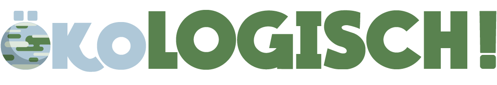

<!-- PROJECT LOGO -->
 

  

  <h3 align="center">ökoLOGISCH</h3>

  

    E-Learning-Plattform for children from the fourth to the sixth grade.  
     
     
    <a href="https://746784-8.web1.fh-htwchur.ch/">View Demo</a>
  

<!-- TABLE OF CONTENTS -->
## Table of Contents

- [Table of Contents](#table-of-contents)
- [About The Project](#about-the-project)
  - [Used technologies and frameworks](#used-technologies-and-frameworks)
- [License](#license)
- [Contact](#contact)

<!-- ABOUT THE PROJECT -->
## About The Project
*„My thing will contribute something to another society during and also after Corona.“*

Something like that was the assignment. The goal was to develop a project that could help the society. Exactly in times like these creative minds and innovative ideas are important.
Our basic idea was to create something for children. The main topic for this were the sustainability goals.

After a long period of ideation we could decide which medium we wanted to create. A web application. This website should be tailored to children in such a way that they are not bored, which can be a real challenge. Within the website you can find various drawings, specially designed icons and logos as well as animations and small mini-games.

We have chosen sustainability target 12 as our main topic. This is basically about sustainable consumption and production patterns. However, these terms are chosen very broadly.

### Used technologies and frameworks

* [Bootstrap](https://getbootstrap.com/)
* [PHP](https://www.php.net/)
* [JS](https://developer.mozilla.org/de/docs/Web/JavaScript)
* [SASS](https://sass-guidelin.es/de/)

<!-- LICENSE -->
## License

Distributed under the MIT License. See `LICENSE` for more information.

<!-- CONTACT -->
## Contact

* Frank Zinsli - [frank.zinsli@gmail.com](mailto:frank.zinsli@gmail.com ) -  [frankzinsli.ch](https://frankzinsli.ch)
* Sandro Anderes - [sandroanderes@outlook.com](mailto:sandroanderes@outlook.com ) -  [sandroanderes.ch](https://sandroanderes.ch)

Project Link: [https://github.com/Frankie1996/Visu5](https://github.com/Frankie1996/Visu5)